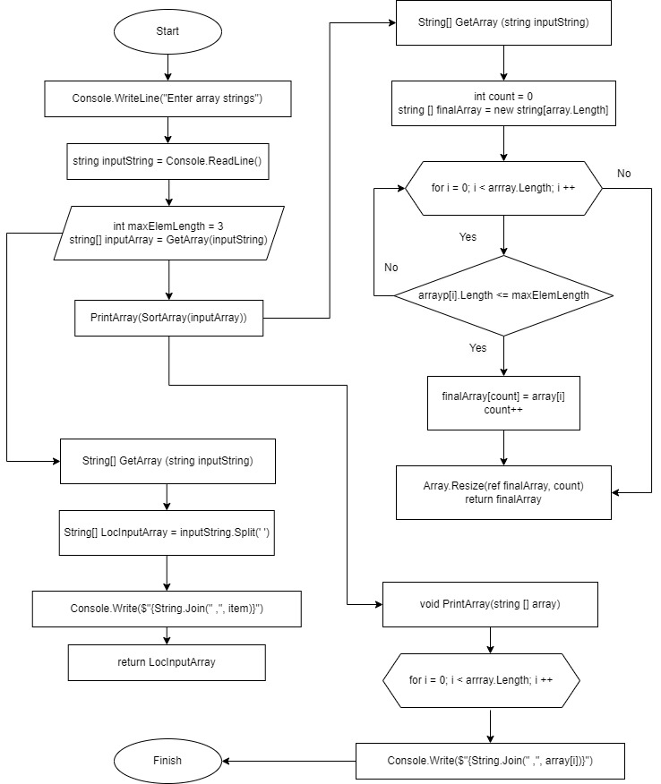

# Итоговый проект
Написать программу, которая из имеющегося массива строк формирует массив строк, длина которых меньше либо равна 3 символа. Первоначальный массив можно ввести с клавиатуры, либо задать на старте выполнения алгоритма. При решении не рекомендуется пользоваться коллекциями, лучше обойтись исключительно массивами.

## Решение
* Получаем массив строк, введенных пользователем. 
* Создаем переменную типа *string inputString* и считываем введенные строки.
* Создаем переменную *int maxElemLength* и задаем ей значение = 3.
* Создаем метод *GetArray* для создания и вывода массива строк.
* Создаем массив *LocInputArray* и заполняем его элементами, полученными разбиением введенной строки.
* Выводим полученный массив.
* Создаем метод *SortArray*, задаем переменную-счетчик *count = 0* и массив *finalArray*, длина которого равна длине исходного массива.
* Циклом *for* проходимся по всей длинне массива и сортируем элементы условием *array[i].Length <= maxElemLength*, полученные элементы записываем в массив *finalArray*, а количество элементов - в переменную *count*.
* Методом *Resize* изменияем длину массива на равную полученным элементам и возвращаем полученный массив.
* Создаем void метод *PrintArray* и циклом *for* выводим полученный массив на печать.

### Блок-схема решения задачи
